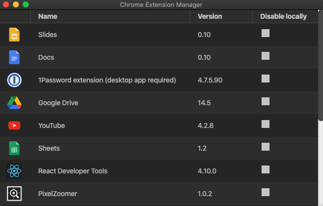

# Chrome Extension Manager

## About
A tool to disable certain extensions on the local machine that would get installed otherwise due to them being synced from your google account. Disabling a extension locally does not affect synced machines.

**Disclaimer:**
Currently, I don't plan on continuing development on this tool. For myself, I don't need that feature anymore. I just wanted to finish it to the point, where the core functionality works.

If you see value in using this, I'd be happy if you star the repo. And if you want to have some bug fixed or need an additional feature, feel free to open up an issue. That indicates me that there's actual value in this for people, so I may rethink on keeping the development going.
## Usage
To disable an extension on your local machine, simply tick the checkbox right next to it. To re-enable it, untick the checkbox.

## How it works
Chrome Extension Manager leverages the [ExtensionInstallBlacklist-Policy](https://cloud.google.com/docs/chrome-enterprise/policies/?policy=ExtensionInstallBlacklist) to disable extensions on your local machine without affecting synced settings.

